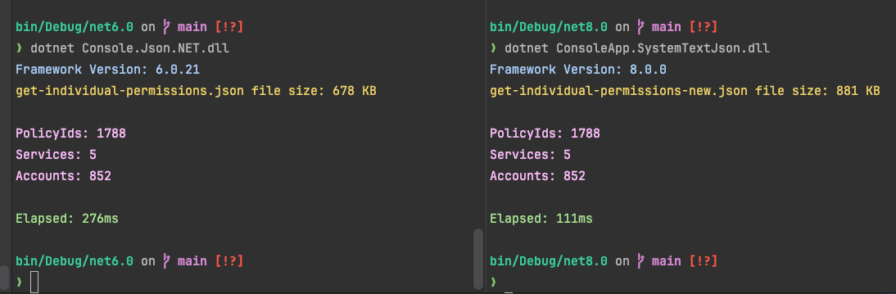

# What's new in .NET 8 / C# 12

<style>
     .colored-table th {
        background: grey;
    }

    .colored-table tr:nth-child(1) { background: indianred; }
    .colored-table tr:nth-child(3) { color: black; background: darkorange; }
    .colored-table tr:nth-child(5) { color: black; background: forestgreen; }
</style>

<div class="colored-table">

| .NET Version | C# Version | Year Released | EOL      |
|--------------|------------|---------------|----------|
| .NET Core 3  | C# 8       | 2019          | Dec 2022 |
| .NET Core 5  | C# 9       | 2020          | May 2022 |
| .NET Core 6  | C# 10      | 2021          | Nov 2024 |
| .NET Core 7  | C# 11      | 2022          | May 2024 |
| .NET Core 8  | C# 12      | 2023          | Nov 2026 |

</div>

[.NET and C# Highlights Info Graphic](https://nietras.com/2023/11/14/dotnet-and-csharp-versions/)


## Primary Constructors

Primary constructors bring the ability to declare a constructor and initialize properties in one line of code. This is similar to how records work, but it can be used with classes and structs as well.

##### Before

```csharp
public class User
{
    // With Explicit Constructor 
    public User(string userName, string fullName)
    {
        UserName = userName;
        FullName = fullName;
    }
    
    public string UserName { get; }
    public string FullName { get; }
}

```

#### After (C# 12)

```csharp

// With Primary Constructor
public class UserClass(string userName, string fullName)
{
    public string UserName { get; } = userName;
    public string FullName { get; } = fullName;
}
```

#### Records (C# 9)

```chsarp

public record User(string UserName, string FullName);
```


##  Records vs Classes vs Struct

| Feature                   |Record|Class|Struct|
|---------------------------|-------|------|-------|
| Automatic Value equality? | ✅ | ❌ |✅|
| Immutable                 | ✅ | ❌ |✅|
| Memory Allocation         | Heap | Heap | Stack (faster) |


## Primary Constructors for Records vs Classes

|Feature|Record|Class|Struct|
|-------|-------|-------|-------|
|Members Exposed Automatically? | ✅ |❌ |✅ |
|Equality By Value? | ✅ | ❌ |✅ |


## CollectionExpressions


##### Before
```csharp
int[] a = new int[] ｛1, 2, 3, 4, 5, 6,7,8｝；
 // or
var a = new int[] { 1, 2, 3, 4, 5, 6, 7, 8};
```

##### After
```csharp
int[] a = [1, 25 3, 4, 5, 6, 7, 8];
// cant use var
//var a2 = [1, 25 3, 4, 5, 6, 7, 8];
```


## Type Aliases

##### Before

```csharp
public class Square
{
    public (int X, int Y, int Width, int Height) GetBoundaries() => new (X, Y, Width, Height);
    public void SetBoundaries((int X, int Y, int Width, int Height) boundaries) { .... }
}
```

##### After

```csharp
using Boundaries = (int X, int Y, int Width, int Height);
public class Square
{
public Boundaries GetBoundaries()
=> new (X, Y, Width, Height);
public void SetBoundaries(Boundaries boundaries) { .... }
}

```

## Inline Arrays

Arrays are usually allocated on the heap, which is slower than allocating on the stack. Inline arrays are fixed size, allocated on the stack, which makes them faster.
> Note: Inline arrays are only available for value types that can be stored on the stack, like structs
##### Before

```csharp
public class Flag
{
    public Flag(byte value)
    {
        Value = value;
    }
    
    public byte Value {get;set;}
}

var flags = new Flag[3] { new Flag(1), new Flag(3), new Flag(5) };
```

##### After

```csharp
[System.Runtime.CompilerServices.InlineArray(3)]
public class FlagArray
{
    private int _value;
}

var flags = new FlagArray();
flags[0] = 1;
flags[1] = 2
```

# .NET 8 Runtime Features

## FrozenSet/FrozenDictionary

FrozenDictionary is a new immutable dictionary type that is optimized for read-only scenarios. It is immutable, so it can be shared across threads without the need for locking. It is also optimized for read-only scenarios, so it is faster than regular dictionaries.
> Note: There is a performance penalty when creating the FrozenDictionary or FrozenSet


[Benchmarks](https://steven-giesel.com/blogPost/34e0fd95-0b3f-40f2-ba2a-36d1d4eb5601)

BenchmarkDotNet=v0.13.2, OS=macOS Monterey 12.6.1 (21G217) [Darwin 21.6.0]
Apple M1 Pro, 1 CPU, 10 logical and 10 physical cores
.NET SDK=8.0.100-alpha.1.22570.9
[Host]     : .NET 8.0.0 (8.0.22.55902), Arm64 RyuJIT AdvSIMD
DefaultJob : .NET 8.0.0 (8.0.22.55902), Arm64 RyuJIT AdvSIMD

```csharp
    private const int Iterations = 1000;
    
    List<int> list = Enumerable.Range(0, Iterations).ToList();
    FrozenSet<int> frozenSet = Enumerable.Range(0, Iterations).ToFrozenSet();
    HashSet<int> hashSet = Enumerable.Range(0, Iterations).ToHashSet();
    ImmutableHashSet<int> immutableHashSet= Enumerable.Range(0, Iterations).ToImmutableHashSet();
```

#### Benchmarks on `collection.Contains(x)`:

| Method                 |      Mean |     Error |    StdDev | Ratio |
|------------------------|----------:|----------:|----------:|------:|
| LookupList             | 57.561 us | 0.1346 us | 0.1124 us |  1.00 |
| LookupHashSet          |  2.997 us | 0.0314 us | 0.0294 us |  0.05 |
| LookupImmutableHashSet | 15.422 us | 0.3034 us | 0.6333 us |  0.26 |
| LookupFrozenSet        |  1.963 us | 0.0119 us | 0.0093 us |  0.03 |


#### Benchmarks on Creating the Collections

| Method                 |         Mean |     Error |    StdDev |  Ratio | RatioSD |
|------------------------|-------------:|----------:|----------:|-------:|--------:|
| CreateList             |     251.9 ns |   2.41 ns |   2.14 ns |   1.00 |    0.00 |
| CreateHashSet          |   6,694.7 ns | 132.08 ns | 171.74 ns |  26.72 |    0.74 |
| CreateImmutableHashSet | 200,541.6 ns | 972.71 ns | 812.25 ns | 796.58 |    8.33 |
| CreateFrozenSet        |  57,626.2 ns | 973.67 ns | 910.77 ns | 228.94 |    4.17 |


## Keyed services support in Dependency Injection

Registering and retrieving Dependency Injection (DI) services using keys


| Regular                                    | Keyed         |
|--------------------------------------------|---------------|
| AddTransient<TService, TImplementation>()  | AddKeyedTransient<TService, TImplementation>(object key) |
| AddScoped<TService, TImplementation>()     | AddKeyedScoped<TService, TImplementation>(object key)    |
| AddSingleton<TService, TImplementation>()  | AddKeyedSingleton<TService, TImplementation>(object key) |

#### Registering Keyed Services Example

```csharp

var builder = WebApplication.CreateBuilder(args);
builder.Services.AddKeyedSingleton<INotificationService, SmsNotificationService>("sms");
builder.Services.AddKeyedSingleton<INotificationService, EmailNotificationService>("email");
builder.Services.AddKeyedSingleton<INotificationService, PushNotificationService>("push");

```

#### Resolving Keyed Services


```csharp
// Via Primary Constructor Injection
// Uses the key "sms" to select the SmsNotificationService specifically
public class SmsService([FromKeyedServices("sms")] INotificationService sms)
{
    public string Notify(string message) => sms.Notify(message);
}

// Via Method Injtion
public class EmailService
{
    // Uses the key "email" to select the EmailNotificationService specifically
    public void NotifyViaEmail([FromKeyedServices("email")] INotificationService email)
    {
        email.Notify(message);
    }
}

// Old School

public class SmsService
{
    private readonly INotificationService _service;

    public SmsService(IServiceProvider serviceProvider)
    {
        _service = serviceProvider.GetRequiredKeyedService<IService>(ServiceImplementation.A);
    }
    
    public void  Notify(string message)
    {
       _service.Notify(message);
    }
}
```
## Starting and Stopping Worker Services Concurrently

Instead of the default behaviour of sequential startup of hosted services, HostOptions configurations, to `ServicesStartConcurrently` and `ServicesStopConcurrently` to have it start in a WhenAll() fashion.


```csharp
var builder = Host.CreateApplicationBuilder(args);

builder.Services.Configure<HostOptions>(options =>
{
    options.ServicesStartConcurrently = true;
    options.ServicesStopConcurrently = true;
});

builder.Services.AddHostedService<Worker1>();
builder.Services.AddHostedService<Worker2>();
```


## System.Text Performance Improvements compared to JSON.NET

Runtime Timings:


